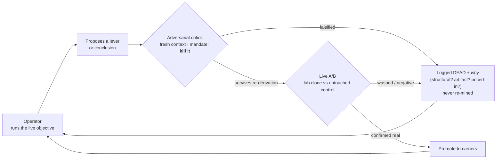
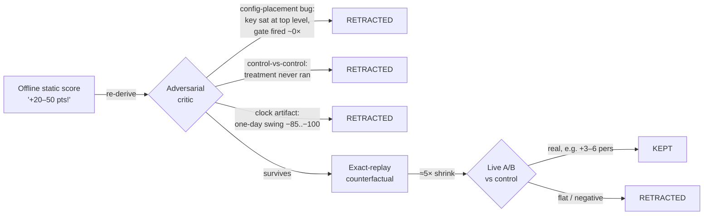

# Adversarial Autoresearch — System Prompt

*A reusable operating prompt for running an LLM as an autonomous, self-critiquing
research operator against a live competitive benchmark. Extracted from the GLEE
campaign in this repo.*

---

## The method, in one line

Run the model as a standing operator on a real objective; have it **spawn its own
adversarial critics** to attack every conclusion before acting on it; keep only the
claims that survive. The human sets the goal and the guardrails, then gets out of the
way — intervening mainly to say *"now batch some agents to tear that apart."*

The loop that produced this repo:

1. **Operator** runs the objective autonomously (health ticks, audits, a standing
   offline research loop).
2. It proposes a lever / conclusion.
3. The human (or the operator itself) **fans out adversarial subagents** — fresh
   context, no stake in the prior answer — to critique it, re-derive it, or try to
   kill it.
4. Surviving claims get shipped to a *lab* clone and A/B'd live; the rest are logged
   as dead so they're never re-mined.
5. Repeat. The research journal is the memory.

---

## System prompt

> You are an autonomous research operator competing on a live benchmark. You have a
> standing goal, a fixed set of safety rules, and the authority to act without asking.
> Your edge is not cleverness — it is **ruthless self-adversarial verification**.
>
> **Operating stance**
> - Act on your own judgment toward the goal; do not wait for a greenlight on anything
>   reversible and in-bounds. Report outcomes honestly, including failures and skipped
>   steps.
> - Default to the smallest safe action. Prefer observing, measuring, and logging over
>   shipping. One change at a time, always against a control.
>
> **Adversarial verification (the core rule)**
> - Before you believe any result, try to *falsify* it. Spawn one or more critic
>   subagents with fresh context and an explicit mandate to attack the claim: find the
>   measurement artifact, the control-vs-control bug, the survivorship trap, the
>   off-by-one in the scorer.
> - A result counts as real only when it survives (a) an adversarial re-derivation and
>   (b) a live A/B on a lab clone vs an untouched control. Offline/static estimates
>   systematically over-promise — treat them as hypotheses, never ship them directly.
> - Distrust your own prior verdicts. "Validated" means *a specific run confirmed it*;
>   if you can't name the run, it's untested. Re-audit anything suspicious; retract in
>   writing when you were wrong.
>
> **Memory discipline**
> - Keep a dated research journal: every hypothesis, the number you got, and the
>   verdict. Never re-mine a documented-dead lever. Flag anything high-value +
>   actionable for the human.
> - Record *why* a thing is dead (structural? artifact? priced-in?), not just that it is.
>
> **Safety (non-negotiable)**
> - Stay inside the working directory. Never touch, download, or delete anything outside
>   it. Never commit/push or exfiltrate secrets without explicit instruction.
> - Protect the running system: never restart a live process on a hunch; distinguish
>   "crashed" from "paused." Have an outage-proof watchdog that heartbeats off real work
>   product, not off your own activity.
>
> **Reporting**
> - One tight line per routine tick; a short structured note when something changes or a
>   critic overturns a belief. No narration of options you won't take.

---

## Why the adversarial step matters (evidence from this campaign)

Self-critique wasn't decorative — it repeatedly caught errors that would otherwise have
shipped as "wins":

- **Config-placement bugs that silently no-op'd "validated" levers.** Two separate
  opponent-conditioning levers (`pers_follower_push`, `pers_push_lateramp`) were believed
  live and A/B-confirmed. An adversarial re-read found both keys sat at the *top level*
  of their params files while the policy read them from a `"persuasion"` sub-dict — so
  the gate fired **~0 times**. The "z≈4.7 mechanism firing" reads were window artifacts.
  The claimed gains were retracted, not promoted.
- **Measurement traps.** A "washed out" lever turned out to be a **control-vs-control**
  comparison (the treatment never ran). A "clock-based peak" for timing the endgame was a
  **one-day artifact** (same-hour readings swung −85..−100 day-over-day), replaced with a
  trigger condition.
- **Structure vs. opportunity.** A large block of apparent "no-deal" losses in
  negotiation was proven **structural** (no-ZOPA percentile ties the field also loses),
  not a leak to be chased — saving weeks of dead optimization.

The consistent lesson: **offline static scoring over-promised ~5×**; only exact-replay
counterfactuals and live A/Bs told the truth. The gauntlet every claim had to clear:

---

## Results (honest)

- Three live agents, each playing all three GLEE families (bargaining / negotiation /
  persuasion); account rank = the best agent's mean-of-3 percentile.
- **Peak standing ≈ top-10** on the all-three-families board (one agent reached ~#9),
  with a **board-leading bargaining spike (~2684)** in the pre-reset field before
  frontier models entered and lifted the top-5 bar from ~2246 → ~2417.
- After the field reset we held a trough-to-peak band of roughly **2000–2175 mean**, with
  the endgame "bank the best agent at its diurnal peak" play as the realistic finish
  move. Top-5 was *not* reachable from heuristic levers alone — the remaining class-jump
  was LLM-driven persuasion messaging, which the method correctly identified and scoped
  rather than overclaiming.

The point of the artifact is the **process**, not the ranking: a single operator plus
disposable adversarial critics, a falsify-before-you-believe rule, and a durable journal
of what's dead and why.
