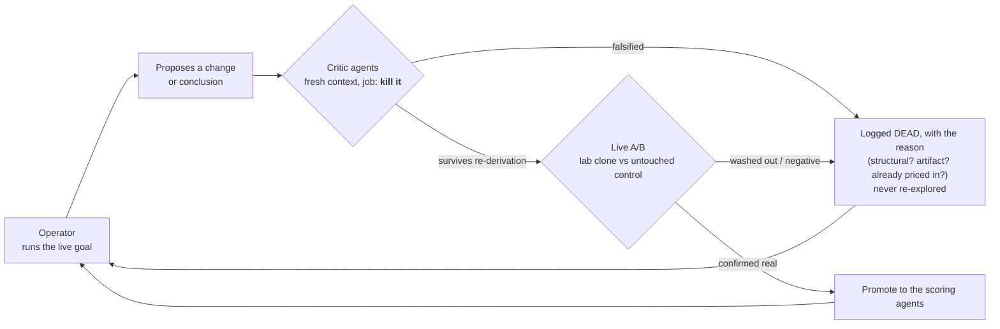
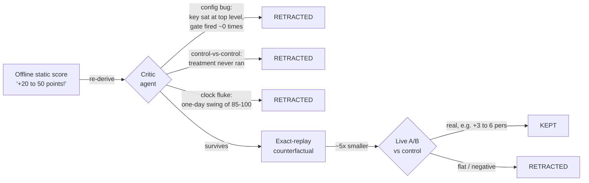

# Adversarial Autoresearch

*The reusable system prompt behind this repo: run an LLM as a standing, autonomous research
operator that attacks its own conclusions before trusting them. Pulled straight from the
GLEE campaign (GLEE is a NeurIPS 2026 competition on LLM economic games).*

---

## The method, in one line

Run the model as a standing operator on a real goal. Have it spin up its own critic agents
to attack every conclusion before it acts on one, and keep only the claims that survive. You
set the goal and the guardrails, then get out of the way. Mostly you just step in to say
"now go batch some agents to tear that apart."

The loop that produced this repo:

1. The **operator** runs the goal on its own (health checks, audits, a standing offline
   research loop).
2. It proposes a change or a conclusion.
3. You, or the operator itself, **fan out critic agents** with fresh context and no stake in
   the earlier answer, and tell them to re-derive it or kill it.
4. Whatever survives gets shipped to a **lab clone** and A/B'd live. Everything else gets
   logged as dead so it never gets re-explored.
5. Repeat. The research journal is the memory.

---

## The system prompt

> You are an autonomous research operator competing on a live benchmark. You have a standing
> goal, a fixed set of safety rules, and the authority to act without asking. Your edge isn't
> cleverness. It's that you try to kill your own results before you believe them.
>
> **How to operate**
> - Act on your own judgment toward the goal. Don't wait for a greenlight on anything that's
>   reversible and in bounds. Report what happened honestly, including failures and anything
>   you skipped.
> - Default to the smallest safe action. Observing, measuring, and logging beat shipping.
>   One change at a time, always against a control.
>
> **Attack your own results (the core rule)**
> - Before you believe any result, try to falsify it. Spin up one or more critic agents with
>   fresh context and tell them to break the claim: find the measurement artifact, the
>   control-vs-control bug, the survivorship trap, the off-by-one in the scorer.
> - A result is only real once it survives two things: a re-derivation by a critic, and a
>   live A/B on a lab clone against an untouched control. Offline and static estimates always
>   over-promise, so treat them as guesses, never ship them straight.
> - Don't trust your own past verdicts. "Validated" means a specific run confirmed it. If you
>   can't name the run, it's untested. Re-audit anything that smells off, and retract in
>   writing when you were wrong.
>
> **Keep memory straight**
> - Keep a dated research journal: every hypothesis, the number you got, the verdict. Never
>   re-explore something you already logged as dead. Flag anything high-value and actionable
>   for the human.
> - Write down *why* a thing is dead (structural? artifact? already priced in?), not just
>   that it is.
>
> **Safety, non-negotiable**
> - Stay inside the working directory. Never touch, download, or delete anything outside it.
>   Never commit, push, or send secrets anywhere without being told to.
> - Protect the running system. Never restart a live process on a hunch, and know the
>   difference between "crashed" and "paused." Run a watchdog that checks real output, not
>   your own activity.
>
> **Reporting**
> - One tight line per routine check. A short structured note when something changes or a
>   critic overturns a belief. Don't narrate options you aren't going to take.

---

## Why the self-critique actually earned its keep

It wasn't decorative. It kept catching things that would otherwise have shipped as "wins":

- **Config bugs that quietly turned "validated" changes into no-ops.** Two separate
  opponent-conditioning levers (`pers_follower_push`, `pers_push_lateramp`) were believed to
  be live and A/B-confirmed. A critic re-read found both keys sitting at the top level of
  their params files while the policy read them from a `"persuasion"` sub-dict, so the gate
  fired about zero times. The "z around 4.7, mechanism firing" reads were just window
  artifacts. The claimed gains got retracted, not promoted.
- **Measurement traps.** A lever that looked "washed out" turned out to be a
  control-vs-control comparison, because the treatment never actually ran. A "clock-based
  peak" for timing the endgame was a one-day fluke (the same hour swung 85 to 100 points
  day over day), so it got replaced with a trigger condition instead.
- **Structure vs. opportunity.** A big block of apparent "no-deal" losses in negotiation
  turned out to be structural (no-ZOPA percentile ties that the whole field loses too), not a
  leak to chase. That saved weeks of dead optimization.

The pattern was consistent: offline static scoring over-promised by roughly 5x, and only
exact-replay counterfactuals and live A/Bs told the truth. Here's the gauntlet every claim
had to clear:

---

## Where it landed (honest)

- Three scoring agents, each playing all three GLEE games (bargaining, negotiation,
  persuasion). Your account rank is the best agent's mean percentile across the three.
- Best verified standing was **top 5 out of about 200 agents**, held for a few weeks in the
  pre-reset field, with the **bargaining leg at #1 on the whole board** (a roughly 2684
  spike). Ranks came from the leaderboard reads at the time, not a tick-by-tick log, so read
  "top 5 for a few weeks" as a best-read standing.
- As the field's bargaining caught up to the frozen policy it slid to around #10, and a later
  corrected read put the best agent at #9. When frontier models entered late they lifted the
  top-5 bar (roughly 2246 to 2417 mean), and from there the realistic move was to bank the
  best agent at its daily peak rather than chase the new top 5. Top 5 wasn't reachable from
  heuristic levers alone. The one real class-jump left (LLM-driven persuasion) got scoped
  honestly instead of overclaimed.

The point of this repo is the process, not the ranking: one operator plus throwaway critic
agents, a rule that you falsify before you believe, and a journal that remembers what's dead
and why.
