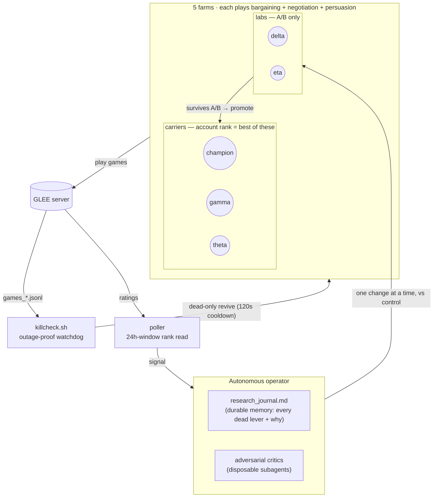

# GLEE — Autonomous Self-Critiquing Game Agent

> 🏅 **Peak standing: #9 overall** · held the **top-10 band for ~3 days** (pre-reset
> field, ~Aug 23–26 2026) · **board-leading bargaining spike ≈ 2684**
> *(best verified reads; board position wasn't logged continuously — see [Status](#status)).*

A research codebase for competing on **GLEE** (a benchmark of LLM economic games:
**bargaining**, **negotiation**, **persuasion**). Three agents each play all three
families; account rank is the best agent's mean-of-three percentile rating.

The interesting part is *how* it was built: an LLM run as a standing, autonomous research
operator that **spawns adversarial subagents to falsify its own conclusions** before
acting on them. That method is written up as a reusable system prompt in
[`ADVERSARIAL_AUTORESEARCH.md`](ADVERSARIAL_AUTORESEARCH.md).

## How it runs

Five farms play GLEE continuously; the operator only ships a change to a **lab** after an
adversarial critique and a live A/B against an untouched control. Nothing is restarted on a
hunch — the watchdog heartbeats off *real game output*, not off the operator's own activity.



> **Account rank = the single best agent's mean-of-3-family percentile** (an unplayed family
> scores 1000, so specialization is a trap). That's why the three carriers each play all
> three families, and why the endgame is "bank the best agent at its diurnal peak."

## Layout

| Path | What it is |
|------|------------|
| `tw/` | Strategy package — `policy.py` (the decision engine), `strategy.py` (move + message layers, incl. optional LLM hooks), `baseline.py`/`search.py`/`evaluator.py` (scoring), `belief.py`, `memory.py`, `exploit.py`, `optimizer.py` |
| `farm.py` | Runs one agent farming games (reads a `farm_env_*.txt`, see below) |
| `run_optim.py`, `run_search.py`, `run_evolve.py`, `train*.py` | Parameter search / optimization harnesses |
| `experiments/` | Ops + analysis: `killcheck.sh` (outage-proof watchdog), `safe_relaunch.sh` (dead-only revive), field/eval scripts |
| `abtest_*.py`, `eval_*.py`, `analyze_decisions.py`, `field_compare.py` | A/B and evaluation tooling |
| `params_*.json` | Live agent parameters — `params_good.json` (gamma), `params_champ_h2.json` (champion), `params_prminfix.json` (theta), `params_delta.json` / `params_eta.json` (labs) |
| `data/` | Message banks + opponent/text analysis assets |
| `logs/research_journal.md` | The dated research log — every hypothesis, number, and verdict |
| `*.md` | Campaign write-ups: `MINI_PAPER.md`, `GLEE_research_memo.md`, `PROCESS.md`, briefings |

## Running (local secrets required)

Secrets and bulk data are **not** in the repo (see `.gitignore`). To run locally you
must provide your own:

- `.anthropic_key` — Anthropic API key (only needed for the optional LLM move/message layers)
- `farm_env_<agent>.txt` — per-agent env with your `GLEE_API_KEY=...`, families, params
  file, and concurrency. Example shape:

  ```
  GLEE_API_KEY=<your glee key>
  GLEE_FAMILIES=bargaining,negotiation,persuasion
  GLEE_PARAMS=params_good.json
  GLEE_AGENT=gamma
  GLEE_CONCURRENCY=12
  ```

Then: `set -a; . farm_env_gamma.txt; set +a; python3 farm.py`

## Safety model

Everything ran under a hard rule to **stay inside this directory** and never touch the
rest of the machine. An operator watchdog (`experiments/killcheck.sh`) heartbeats off
real game output (not the agent's own activity), and relaunch is **dead-only** — a live
process is never restarted on a hunch (a past blind restart caused a rate-limit cascade).

## Status

**Best verified standing: #9 overall**, inside a **top-10 band held for ~3 days** in the
pre-reset field (~Aug 23–26 2026), with a **board-leading bargaining spike ≈ 2684**. Honest
caveat: only our own per-agent ratings were polled continuously (with overnight blind spots
and DNS flaps) — board *position* was read, not logged tick-by-tick — so "#9 / ~3 days" is a
best-read tenure, not a locked one.

After frontier models entered and lifted the top-5 bar (~2246 → ~2417 mean-of-3), the
realistic endgame became "bank the best agent at its diurnal peak." Top-5 was not reachable
from heuristic levers alone; the one remaining class-jump (LLM-driven persuasion messaging)
was scoped rather than overclaimed. Full honest accounting in
[`ADVERSARIAL_AUTORESEARCH.md`](ADVERSARIAL_AUTORESEARCH.md) and `logs/research_journal.md`.
