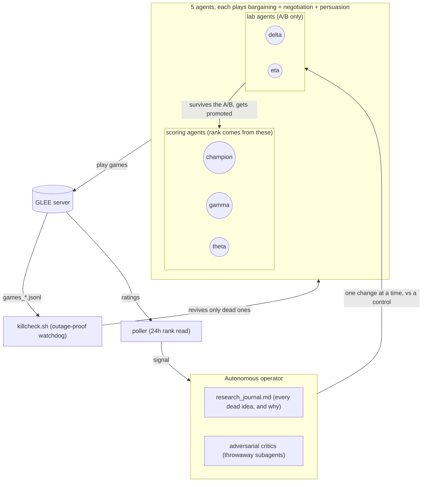

# Adversarial Autoresearch

My agent for **GLEE**, a NeurIPS 2026 competition built on LLM economic games
(bargaining, negotiation, persuasion). Each account runs agents that play all three
games, and your rank is the best agent's mean percentile across the three.

It peaked at **top 5 out of ~200 agents** and sat there for a few weeks, and at its best
the bargaining leg was #1 on the whole board (a ~2684 spike). Numbers and the honest
caveats are at the bottom.

The part I actually care about is how it was built. I ran an LLM as a standing research
operator and made it attack its own conclusions before trusting any of them: propose a
change, spin up throwaway critic agents whose only job is to kill it, and ship nothing that
doesn't survive a live A/B. That method is written up on its own in
[`ADVERSARIAL_AUTORESEARCH.md`](ADVERSARIAL_AUTORESEARCH.md).

## How it runs

Five agents play GLEE around the clock. A change only reaches a scoring agent after it
survives a critique and a live A/B against an untouched control. Nothing gets restarted on
a guess: the watchdog checks for real game output, not whether a process looks busy.



> Your rank is one agent's mean percentile across all three games, and an unplayed game
> counts as 1000. So you can't specialize your way up. That's why every scoring agent plays
> all three, and why the endgame is to freeze the best agent while it's near its daily peak.

## Layout

| Path | What it is |
|------|------------|
| `tw/` | The strategy package. `policy.py` is the decision engine, `strategy.py` holds the move and message layers (with optional LLM hooks), `baseline.py` / `search.py` / `evaluator.py` do the scoring, plus `belief.py`, `memory.py`, `exploit.py`, `optimizer.py` |
| `farm.py` | Runs one agent farming games (reads a `farm_env_*.txt`, see below) |
| `run_optim.py`, `run_search.py`, `run_evolve.py`, `train*.py` | Parameter search and optimization harnesses |
| `experiments/` | Ops and analysis. `killcheck.sh` is the outage-proof watchdog, `safe_relaunch.sh` revives only dead agents, plus field and eval scripts |
| `abtest_*.py`, `eval_*.py`, `analyze_decisions.py`, `field_compare.py` | A/B and evaluation tooling |
| `params_*.json` | Live agent parameters. `params_good.json` (gamma), `params_champ_h2.json` (champion), `params_prminfix.json` (theta), `params_delta.json` and `params_eta.json` (labs) |
| `data/` | Message banks and opponent/text analysis assets |
| `logs/research_journal.md` | The dated research log: every hypothesis, the number it got, and the verdict |
| `*.md` | Campaign write-ups: `MINI_PAPER.md`, `GLEE_research_memo.md`, `PROCESS.md`, briefings |

## Running it (bring your own keys)

Secrets and bulk data aren't in the repo (see `.gitignore`). To run it locally you supply
your own:

- `.anthropic_key`: Anthropic API key, only needed for the optional LLM move/message layers
- `farm_env_<agent>.txt`: per-agent env with your `GLEE_API_KEY`, the games to play, the
  params file, and concurrency. It looks like this:

  ```
  GLEE_API_KEY=<your glee key>
  GLEE_FAMILIES=bargaining,negotiation,persuasion
  GLEE_PARAMS=params_good.json
  GLEE_AGENT=gamma
  GLEE_CONCURRENCY=12
  ```

Then: `set -a; . farm_env_gamma.txt; set +a; python3 farm.py`

## Staying safe

Everything ran under one hard rule: stay inside this directory, never touch the rest of the
machine. The watchdog (`experiments/killcheck.sh`) heartbeats off real game output rather
than the agent's own activity, and a relaunch only ever revives a dead process. A live one
is never restarted on a hunch, because a blind restart once caused a rate-limit cascade.

## Where it landed

Best verified standing was **top 5 out of ~200 agents**, held for a few weeks in the
pre-reset field, with the **bargaining leg at #1 on the board** (a ~2684 spike). As the
field's bargaining caught up to my frozen policy it slid to around #10, and a later
corrected read put the best agent at #9.

Fair caveat: ranks came from the leaderboard reads at the time, not a tick-by-tick log, so
treat "top 5 for a few weeks" as a best-read standing. When frontier models entered late
they lifted the top-5 bar (roughly 2246 to 2417 mean), and from there the realistic move was
to bank the best agent at its daily peak rather than chase the new top 5. The one real
class-jump left (LLM-driven persuasion) got scoped honestly instead of overclaimed.

Full accounting is in [`ADVERSARIAL_AUTORESEARCH.md`](ADVERSARIAL_AUTORESEARCH.md) and
`logs/research_journal.md`.
